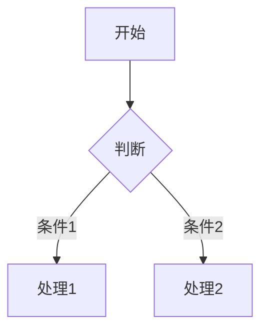

# MD Editor

一个**高性能**、**轻量级**的 Markdown 编辑器，使用 **Rust + Tauri** 构建。

[](https://www.rust-lang.org/)
[](https://tauri.app/)
[](LICENSE)

> 💡 **一句话**：比 Electron 更轻量，比原生应用更易扩展的 Markdown 编辑器。

---

## ✨ 核心亮点

### 1. 极致轻量

| 编辑器 | 体积 | 内存占用 |
|--------|------|----------|
| Obsidian | ~300MB | ~300MB+ |
| Typora | ~60MB | ~150MB |
| VS Code | ~200MB | ~300MB+ |
| **MD Editor** | **~15MB** | **~80MB** |

> Tauri 使用系统 WebView，无需打包 Chromium，体积比 Electron 小 **90%**。

### 2. 完整的 Markdown 支持

- ✅ 实时预览 - 编辑与预览零延迟同步
- ✅ GitHub Flavored Markdown - 表格、任务列表、代码块等
- ✅ **Mermaid 图表** - 流程图、时序图、甘特图实时渲染
- ✅ 数学公式 - 支持 LaTeX 公式（KaTeX 渲染）

```markdown


### 3. 强大的文件管理

- 📁 **VS Code 风格**侧边栏文件树
- 🔄 实时同步文件变更
- 📝 右键新建/重命名/删除文件
- 📂 支持**拖放打开**文件夹和文件
- 🔗 双击 `.md` 文件关联打开

### 4. 专业编辑体验

| 快捷键 | 功能 |
|--------|------|
| `Cmd/Ctrl + S` | 保存文件 |
| `Cmd/Ctrl + O` | 打开文件 |
| `Cmd/Ctrl + N` | 新建文件 |
| `Cmd/Ctrl + Shift + S` | 另存为 |
| `Cmd/Ctrl + B` | 切换侧边栏 |
| `Cmd/Ctrl + P` | 切换预览/分屏模式 |

- 🎨 **多主题** - 暗色/亮色/森林/中性等 Mermaid 主题
- 📊 **图表导出** - Mermaid 图表可导出为 SVG/PNG
- 🖼️ **图片预览** - 本地图片自动加载预览

---

## 📊 对比其他编辑器

| 特性 | MD Editor | Typora | Obsidian | MarkText |
|------|-----------|--------|----------|----------|
| 开源 | ✅ | ❌ | ❌ | ✅ |
| **轻量 (<20MB)** | **✅** | ❌ | ❌ | ❌ |
| **Mermaid 图表** | **✅** | 部分 | 插件 | ❌ |
| **文件树管理** | **✅** | ❌ | ✅ | ❌ |
| **图表导出** | **✅** | ❌ | 插件 | ❌ |
| 实时预览 | ✅ | ✅ | ✅ | ✅ |
| 跨平台 | ✅ | ✅ | ✅ | ✅ |

---

## 🚀 快速开始

### 环境要求

- [Rust](https://rustup.rs/) 1.75+
- [Node.js](https://nodejs.org/) 16+（用于构建前端资源，可选）

### 安装

```bash
# 克隆仓库
git clone https://github.com/yourusername/md-editor.git
cd md-editor

# 开发模式
cargo tauri dev

# 构建发布版本
cargo tauri build
```

构建完成后：
- **macOS**: `src-tauri/target/release/bundle/macos/MD Editor.app`
- **Windows**: `src-tauri/target/release/bundle/msi/`
- **Linux**: `src-tauri/target/release/bundle/deb/`

---

## 📁 项目结构

```
md-editor/
├── src/                    # Rust 后端源码
│   ├── main.rs            # 入口
│   └── lib.rs             # 核心逻辑
├── index.html             # 前端界面（单文件）
├── icons/                 # 应用图标
├── tauri.conf.json        # Tauri 配置
├── Cargo.toml             # Rust 依赖
└── README.md
```

---

## 🛠️ 技术栈

- **[Tauri](https://tauri.app/)** - Rust 编写的桌面应用框架
- **[Rust](https://www.rust-lang.org/)** - 系统级编程语言，安全且高性能
- **[Marked](https://marked.js.org/)** - 极速 Markdown 解析器
- **[Mermaid](https://mermaid.js.org/)** - 图表绘制工具

---

## 🤝 参与贡献

欢迎提交 Issue 和 Pull Request！

1. Fork 本项目
2. 创建功能分支 (`git checkout -b feature/AmazingFeature`)
3. 提交更改 (`git commit -m 'Add some AmazingFeature'`)
4. 推送到分支 (`git push origin feature/AmazingFeature`)
5. 打开 Pull Request

查看 [CONTRIBUTING.md](CONTRIBUTING.md) 了解更多。

---

## 📜 许可证

本项目采用 [MIT](LICENSE) 许可证开源。

---

## 🙏 致谢

- [Tauri](https://tauri.app/) - 安全的桌面应用框架
- [Mermaid](https://mermaid.js.org/) - 强大的图表绘制库

---

<p align="center">Made with 🦀 in Rust</p>
