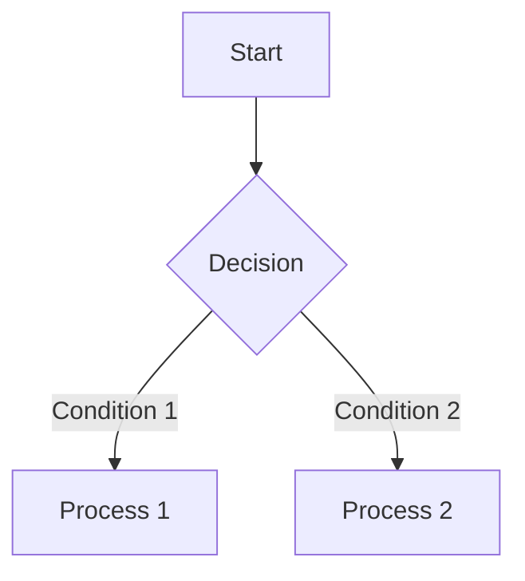

# MD Editor

A **high-performance**, **lightweight** Markdown editor built with **Rust + Tauri**.

[](https://www.rust-lang.org/)
[](https://tauri.app/)
[](LICENSE)

> 💡 **In a nutshell**: A Markdown editor that's lighter than Electron and more extensible than native apps.

---

## ✨ Key Highlights

### 1. Extremely Lightweight

| Editor | Size | Memory Usage |
|--------|------|--------------|
| Obsidian | ~300MB | ~300MB+ |
| Typora | ~60MB | ~150MB |
| VS Code | ~200MB | ~300MB+ |
| **MD Editor** | **~15MB** | **~80MB** |

> Tauri uses system WebView, no need to bundle Chromium, **90%** smaller than Electron.

### 2. Complete Markdown Support

- ✅ Live Preview - Zero-latency sync between edit and preview
- ✅ GitHub Flavored Markdown - Tables, task lists, code blocks, etc.
- ✅ **Mermaid Diagrams** - Real-time rendering of flowcharts, sequence diagrams, Gantt charts
- ✅ Math Formulas - LaTeX formula support (KaTeX rendering)

```markdown


### 3. Powerful File Management

- 📁 **VS Code-style** sidebar file tree
- 🔄 Real-time file change synchronization
- 📝 Right-click new/rename/delete files
- 📂 Support **drag & drop** to open folders and files
- 🔗 Double-click `.md` files to open

### 4. Professional Editing Experience

| Shortcut | Function |
|----------|----------|
| `Cmd/Ctrl + S` | Save file |
| `Cmd/Ctrl + O` | Open file |
| `Cmd/Ctrl + N` | New file |
| `Cmd/Ctrl + Shift + S` | Save as |
| `Cmd/Ctrl + B` | Toggle sidebar |
| `Cmd/Ctrl + P` | Toggle preview/split mode |

- 🎨 **Multiple Themes** - Dark/Light/Forest/Neutral Mermaid themes
- 📊 **Diagram Export** - Mermaid diagrams exportable to SVG/PNG
- 🖼️ **Image Preview** - Local images automatically loaded and previewed

---

## 📊 Comparison with Other Editors

| Feature | MD Editor | Typora | Obsidian | MarkText |
|---------|-----------|--------|----------|----------|
| Open Source | ✅ | ❌ | ❌ | ✅ |
| **Lightweight (<20MB)** | **✅** | ❌ | ❌ | ❌ |
| **Mermaid Diagrams** | **✅** | Partial | Plugin | ❌ |
| **File Tree** | **✅** | ❌ | ✅ | ❌ |
| **Diagram Export** | **✅** | ❌ | Plugin | ❌ |
| Live Preview | ✅ | ✅ | ✅ | ✅ |
| Cross-Platform | ✅ | ✅ | ✅ | ✅ |

---

## 🚀 Quick Start

### Prerequisites

- [Rust](https://rustup.rs/) 1.75+
- [Node.js](https://nodejs.org/) 16+ (for building frontend resources, optional)

### Installation

```bash
# Clone repository
git clone https://github.com/yourusername/md-editor.git
cd md-editor

# Development mode
cargo tauri dev

# Build release version
cargo tauri build
```

After building:
- **macOS**: `src-tauri/target/release/bundle/macos/MD Editor.app`
- **Windows**: `src-tauri/target/release/bundle/msi/`
- **Linux**: `src-tauri/target/release/bundle/deb/`

---

## 📁 Project Structure

```
md-editor/
├── src/                    # Rust backend source
│   ├── main.rs            # Entry
│   └── lib.rs             # Core logic
├── index.html             # Frontend UI (single file)
├── icons/                 # App icons
├── tauri.conf.json        # Tauri config
├── Cargo.toml             # Rust dependencies
└── README.md
```

---

## 🛠️ Tech Stack

- **[Tauri](https://tauri.app/)** - Rust-based desktop app framework
- **[Rust](https://www.rust-lang.org/)** - Systems programming language, safe and high-performance
- **[Marked](https://marked.js.org/)** - Fast Markdown parser
- **[Mermaid](https://mermaid.js.org/)** - Diagram drawing tool

---

## 🤝 Contributing

Issues and Pull Requests are welcome!

1. Fork the repository
2. Create your feature branch (`git checkout -b feature/AmazingFeature`)
3. Commit your changes (`git commit -m 'Add some AmazingFeature'`)
4. Push to the branch (`git push origin feature/AmazingFeature`)
5. Open a Pull Request

See [CONTRIBUTING.md](CONTRIBUTING.md) for more details.

---

## 📜 License

This project is open-sourced under the [MIT](LICENSE) License.

---

## 🙏 Acknowledgments

- [Tauri](https://tauri.app/) - Secure desktop application framework
- [Mermaid](https://mermaid.js.org/) - Powerful diagram drawing library

---

<p align="center">Made with 🦀 in Rust</p>
